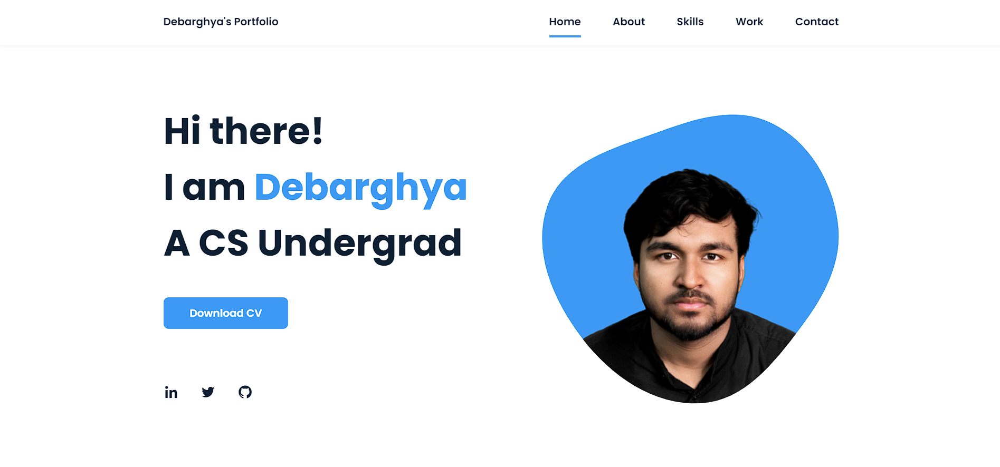

# Personal Portfolio

Welcome to my personal portfolio website! This repository hosts the code and assets for my portfolio website, which can be accessed at [https://itsdchanda.github.io/portfolio/](https://itsdchanda.github.io/portfolio/).

## Features

- Project Showcase: Collection of my projects with descriptions and links.
- Skills Highlight: A section dedicated to highlighting my skills.
- About Me: Information about me, my background, and interests.
- Contact: Various ways to get in touch with me.

## Technologies

- HTML5
- CSS3
- JavaScript
- Bootstrap - Front-end framework for responsive design
- Font Awesome - Icons toolkit

## Installation

1. Clone this repository:
   git clone https://github.com/itsdchanda/portfolio.git
   
2. Navigate to the project's root directory:
	cd portfolio
	
3. Open the `index.html` file in your web browser.

## Usage

Explore the website to learn more about me, my projects, and skills. Browse through the projects and click on the links to visit live versions or GitHub repositories. For any inquiries or collaboration opportunities, please use the contact information provided.

## License

This project is licensed under the MIT License. See the [LICENSE](LICENSE) file for details.

Feel free to connect and get in touch!
